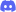

<h1 align="center">⭑ ☄️🔮✒️ MAS Selector City 💡💎💫 ⭑</h1>
<h3 align="center">"O que eu deveria usar hoje?" ~ Monika</h3>

Bem vindo ao Selector City!

  

Isso é uma coleção de seletores submods feita ou atualmente mantida por u/mayday-mayjay !

## 👑 ⭑ Funcionalidade

✦ ATOMreal's old selectors (máscara, acessórios de mesa) 
✦ Bodymod selectors 
✦ Reg acs selectors 
✦ Split acs selectors 

✨ Clique aqui para uma lista completa de seletores:
 
  * Seletor de máscara  
  * Seletor de acessórios de mesa (esquerda/direita, regular, vaso de flor) 
  * Seletor de mecha teimosa  
  * Seletor de acessório de orelha  
  * Seletor de maquiagem  
  * Seletor de tatuagem (braço esquerdo/direito, corpo)  
  * Seletor de pin  
  * Seletor de esmalte  
  * Seletor de bracelete    
  * Seletor de acessório de cabeça  
  * Seletor de luvas  
  * Seletor de almofada de mesa  
  * Seletor de acessório traseiro  
  * Seletor de óculos  
  * Seletor de anel  

## 👑 ⭑ Como instalar?
  * Baixe na aba de lançamentos (release) e não diretamente do repositório!!  
  * Abra o zip em um programa que permita isso (ex; 7zip ou winRAR)  
  * Mova a pasta do 'MJ-MAS-selector-city-TRADUZIDO-[release number]' para a pasta do DDLC/MAS e mescle (O ATUALIZADOR NÃO FUNCIONARÁ SE FOR MOVIDO PARA OUTRO LUGAR)  
  * Se você não encontrar a pasta "Submods" na pasta "game", faça uma!
  * Abra o MAS e aproveite!
  

## 🌙 ⭑ Créditos

  *  DJMayJay#2001 / O sistema DreamScape
  — criador do conceito principal e codificação do seletor
  *  [u/my-otter-self](https://reddit.com/u/my-otter-self)
   [@my-otter-self](https://github.com/my-otter-self)
  — mantenedor do repositório, ajuda geral
  * RaVen
  — modelo, código seletor original
  * ATOM_real (sigh)
  — código seletor original
 * Ilha
  — tradutora do submod
  * Bach
  — suporte para a permissão da tradução

## 🪐 ⭑ Junte-se ao nosso Discord

Estamos prontos para conversar! Venha se juntar ao nosso servidor do Discord [aqui](https://discord.gg/Tx23rczN8N).

## 📗 Servidor 🇧🇷 para mais traduções

Estamos abertos para conversar e receber pedidos de traduções de submods e spritepacks [aqui](https://discord.gg/bMPDaCVz).
